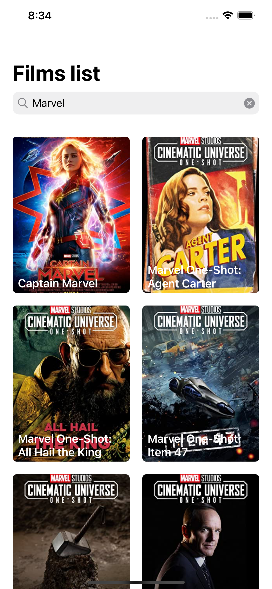
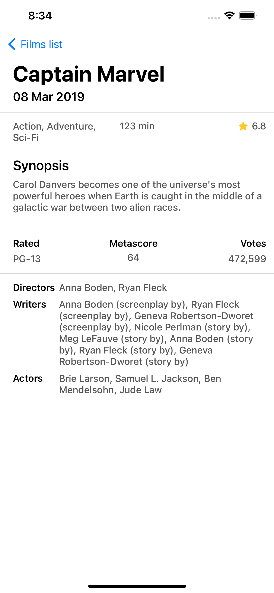

### Architecture
MVVM with reactive programming has been used to separate into small layers which is easy to maintain and write tests.

- **View**: Display the UI, receive interaction from user and send to ViewModel
- **View Model**: Navigate actions received from view to use case, navigator and bind the data back to view if needed
- **Use Case**: Handle the business logic or requesting external data
- **Navigator**: Decide the app flow and help navigate between screens

### Technical Approaches
- Sending search request is debounced 300 milliseconds to avoid sending too many requests while user is typing fast
- When a new character is typed on search bar, previous request is cancelled
- Images are cached and decompressed using Nuke libraries where heavy tasks are processing on background queues and will not affect main queue too much.
- Dark mode is disabled to keep the application simple
- Movie detail screen has a content view which is an UIScrollView to avoid the case where overview is too long and can't display in only 1 screen.
- In case fetching movie detail has error, the information from movie list will be displayed instead of notifying an error
- Due to short amount of time, writing tests is skipped

### Third Parties
- **RxSwift**: Reactive programming and be easier to work with MVVM architecture. (*Why don't I use Combine? - Because I am more familiar with RxSwift than Combine*)
- **RxCocoa**: Make binding data with UIKit components easier
- **Alamofire**: Use some convince function when working with network APIs
- **SnapKit**: Make the code easier to read when using autolayout manually
- **Nuke**: Effectively fetching, caching and decompressing image

### Overview

|         Movies List       |        Movie Detail       |
|---------------------------|---------------------------|
|||
